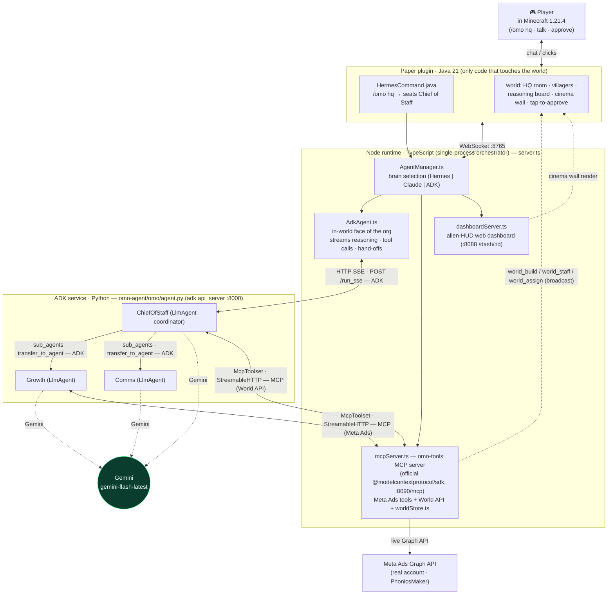

# Omo Mission Control — Architecture & Data Flow

The mandatory trifecta is labelled on the edges/nodes it lives on:
**Gemini** (every agent's model), **ADK** (the multi-agent org over `adk api_server`),
and **MCP** (every tool + the World API, over Streamable HTTP).

## Mermaid



## ASCII fallback

```
   🎮 Player (Minecraft 1.21.4) ── /omo hq · talk · approve
        │  chat / clicks
        ▼
 ┌─────────────────────────────────────────────────────────────┐
 │ Paper plugin (Java 21) — only code that touches the world    │
 │   HermesCommand.java (/omo hq → seats Chief of Staff)        │
 │   world: HQ · villagers · reasoning board · cinema · approve │
 └───────────────┬───────────────────────────────▲─────────────┘
                 │ WebSocket :8765                │ cinema-wall render
                 ▼                                │ (dashboard)
 ┌─────────────────────────────────────────────────────────────┐
 │ Node runtime (TypeScript) — server.ts                        │
 │   AgentManager.ts  → brain select (Hermes | Claude | ADK)    │
 │   AdkAgent.ts      → in-world face; streams reasoning/tools  │
 │   mcpServer.ts     → omo-tools MCP (Meta Ads + World API)    │
 │   dashboardServer.ts → alien-HUD board (:8088 /dash/:id) ────┘
 └──────┬───────────────────────────────────┬──────────────────┘
        │ HTTP SSE  POST /run_sse  [ADK]     │ McpToolset StreamableHTTP [MCP]
        ▼                                    ▲
 ┌──────────────────────────────────┐       │  (World API: build/staff/assign
 │ ADK service (Python)             │       │   broadcast back into the world)
 │ omo-agent/omo/agent.py @ :8000   │       │
 │   ChiefOfStaff (LlmAgent) ──[ADK transfer_to_agent]──► Growth / Comms
 │   every agent's model = Gemini (gemini-flash-latest)  │
 │   tools = McpToolset ─────────────────────────────────┘
 └──────────────────────────────────┘
                                              │ live Graph API
                                              ▼
                                   Meta Ads API (real: PhonicsMaker)
```

## Caption

The player talks to a Chief of Staff villager inside Minecraft; the Paper plugin relays that over a WebSocket (:8765) to the Node runtime, where `AgentManager` routes the `hq` room to the **ADK** brain (`AdkAgent`), which POSTs to the Python ADK service's `/run_sse` and streams every reasoning token, tool call, and `transfer_to_agent` hand-off back onto in-world screens. Each ADK agent runs on **Gemini** and reaches its tools over **MCP** — `McpToolset` connecting via Streamable HTTP to the in-runtime `omo-tools` server, which exposes both real Meta Ads tools (live Graph API on the PhonicsMaker account) and the World API the Chief of Staff uses to extend the org itself. Because the MCP server lives inside the runtime, a `world_build`/`world_staff`/`world_assign` call broadcasts straight back into the live world and drives the in-game villagers, while the dashboard server renders the function's real data onto an in-world cinema wall.
